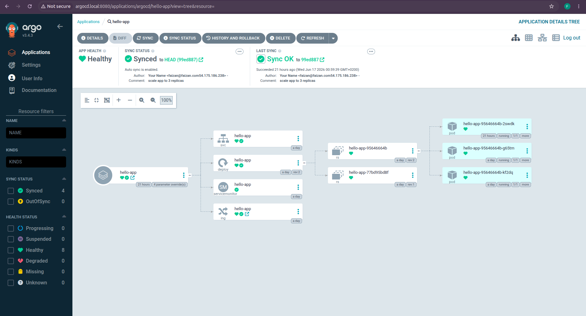
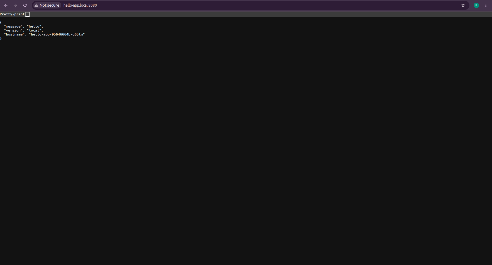
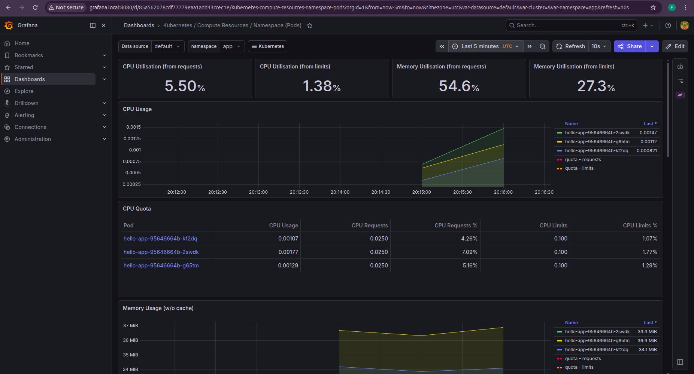
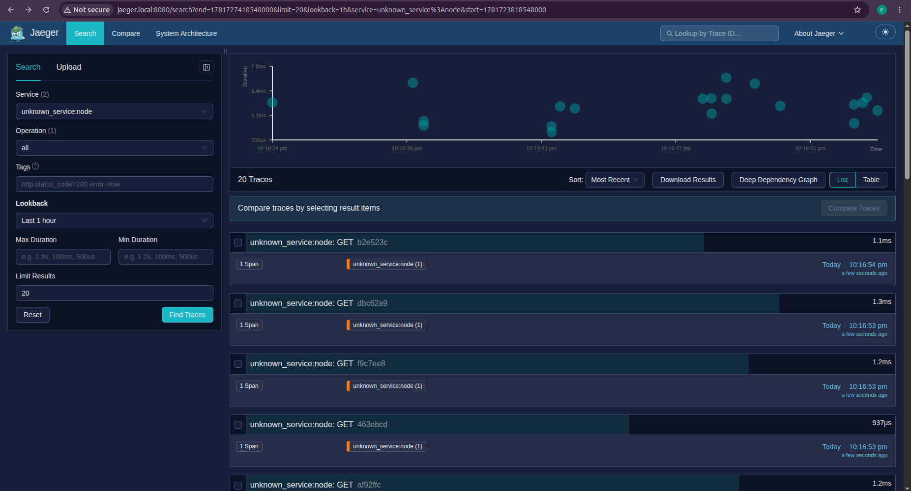

# Interviews

## This repo contains tasks we request interviewees to complete

* This repository should be forked, candidates should work in their own forked versions.
Please don't open pull requests with solutions agains this repository.
* No tasks require the use of any paid services.
* For all of the following tasks please use your favourite tools.
* During the interview the interviewee guides us through
their solution. Explaining decisions and technical concepts as we go.
* Tasks can be solved in a very simplistic way or as complicated as you can imagine.
Both can be valid.

### k8s deployment

* please don't use cloud infra providers like AWS, GCP etc. The cluster should
be a local one.
  
1. Set up a kubernetes cluster ie. kind, minikube, k3s etc.
the one you like the most.
2. Build and release an app. This application should have a dockerfile created
by you and it should be built by you. This can be something very simple,
ie traefik/whoami, hashicorp/http-echo, your own if you have one.
Each release should happen automatically.
3. Create a deployment of this app.

* extras: IaC, GitOps, semver, changelog

### review

* please review [shellscript](shell/script.sh)

* please review [deployment](k8s/nginx.yaml)

* extras: proper explanation

---

## Solution

### Stack

- **App**: Node.js HTTP server with a `/metrics` (Prometheus) and `/healthz` endpoint
- **Tracing**: OpenTelemetry auto-instrumentation → Jaeger
- **Cluster**: k3s via k3d (k3s running inside Docker, no root required)
- **Packaging**: Helm chart
- **GitOps**: ArgoCD — watches the git repo and auto-deploys on every push
- **Monitoring**: kube-prometheus-stack (Prometheus + Grafana) + Jaeger
- **CI**: GitHub Actions — builds and pushes the image to GHCR on every push/tag

### Prerequisites

- Docker
- k3d:
  ```bash
  curl -sSL https://github.com/k3d-io/k3d/releases/download/v5.6.3/k3d-linux-amd64 -o ~/.local/bin/k3d && chmod +x ~/.local/bin/k3d
  ```
- Helm:
  ```bash
  curl -sSL https://get.helm.sh/helm-v3.14.4-linux-amd64.tar.gz | tar -xz && mv linux-amd64/helm ~/.local/bin/
  ```

### /etc/hosts

Add the local domains:

```
127.0.0.1 hello-app.local grafana.local jaeger.local argocd.local
```

### Bring up the cluster

```bash
./scripts/cluster-up.sh
```

This creates the k3d cluster, builds and imports the app image, installs Prometheus, Grafana, Jaeger, and ArgoCD. ArgoCD then takes over and deploys the app from git automatically.

### Access the services

| Service | URL | Credentials |
|---------|-----|-------------|
| App | http://hello-app.local:8080 | - |
| Grafana | http://grafana.local:8080 | admin / admin |
| Jaeger | http://jaeger.local:8080 | - |
| ArgoCD | http://argocd.local:8080 | admin / see below |

ArgoCD initial password:

```bash
kubectl -n argocd get secret argocd-initial-admin-secret -o jsonpath='{.data.password}' | base64 -d
```

### Release a new version

Tag a commit and push:

```bash
git tag v1.2.0
git push origin v1.2.0
```

GitHub Actions builds the image, pushes it to GHCR, then commits the updated tag back to `charts/hello-app/values.yaml`. ArgoCD detects that commit and rolls out the new version automatically.

### Tear down

```bash
./scripts/cluster-down.sh
```

## Screenshots

### ArgoCD


### Hello App


### Grafana


### Jaeger

